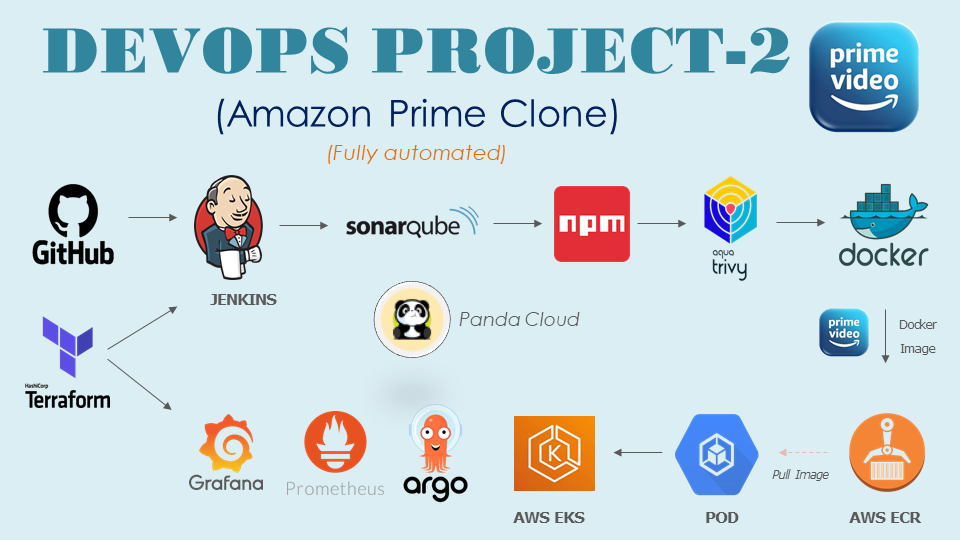

# Web Application Deployment Project


## Project Overview
This project demonstrates the complete deployment of a containerized web application using modern DevOps practices and tools. The focus is on automating infrastructure provisioning, continuous integration, continuous delivery, security scanning, and monitoring to ensure a production-ready workflow.

### Key Tools & Technologies
- **Terraform**: Infrastructure as Code (IaC) for provisioning cloud resources (EC2, EKS, Security Groups, etc.).
- **GitHub**: Source code management and version control.
- **Jenkins**: CI/CD automation.
- **SonarQube**: Code quality and static analysis.
- **NPM**: Build tool for Node.js applications.
- **Aqua Trivy**: Security vulnerability scanning.
- **Docker**: Containerization and image management.
- **AWS ECR**: Private container image registry.
- **AWS EKS**: Managed Kubernetes cluster for container orchestration.
- **ArgoCD**: GitOps-based continuous deployment.
- **Prometheus & Grafana**: Monitoring and alerting.

---

## Pre-requisites
1. **Cloud Account (AWS in this setup)** – [Create an Account](https://docs.aws.amazon.com/accounts/latest/reference/manage-acct-creating.html)  
2. **AWS CLI** – [Installation Guide](https://docs.aws.amazon.com/cli/latest/userguide/getting-started-install.html)  
3. **Terraform** – [Installation Guide](https://developer.hashicorp.com/terraform/tutorials/aws-get-started/install-cli)  
4. **VS Code (Optional)** – [Download](https://code.visualstudio.com/download)  

---

## Infrastructure Setup (Terraform)
1. **Clone the Repository**
   ```bash
   git clone https://github.com/pandacloud1/DevopsProject2.git
   cd DevopsProject2
   code .
   ```

2. **Initialize & Apply Terraform**
   ```bash
   aws configure
   terraform init
   terraform apply --auto-approve
   ```
   This provisions EC2 instances, security groups, and installs tools like Jenkins, Docker, and SonarQube.

---

## SonarQube Setup
1. Login with default credentials (`admin/admin`).
2. Generate an authentication token under `Administration → Security → Users → Tokens`.
3. Save this token for integration with Jenkins.

---

## Jenkins Setup
1. **Add Credentials** (SonarQube token, AWS keys).  
2. **Install Plugins** (SonarQube Scanner, NodeJS, Docker, Prometheus metrics, etc.).  
3. **Configure Global Tools** (JDK 17, NodeJS, SonarQube Scanner, Docker).  

---

## CI/CD Pipeline (Jenkins)
### Pipeline Stages
1. Git Checkout  
2. SonarQube Analysis & Quality Gate  
3. Install Node.js dependencies (NPM)  
4. Security Scanning (Trivy)  
5. Docker Build & Tag  
6. Push Image to AWS ECR  
7. Cleanup of local Docker images  

📌 A sample Jenkins pipeline script is included in the repo.

```groovy
pipeline {
    agent any

    environment {
        SONARQUBE = credentials('sonarqube-token')
        AWS_CREDENTIALS = credentials('aws-credentials')
        DOCKERHUB = credentials('dockerhub-credentials')
    }

    stages {
        stage('Checkout') {
            steps {
                git branch: 'main', url: 'https://github.com/your-org/your-repo.git'
            }
        }

        stage('SonarQube Analysis') {
            steps {
                withSonarQubeEnv('SonarQube') {
                    sh 'mvn clean verify sonar:sonar'
                }
            }
        }

        stage('Install Dependencies') {
            steps {
                sh 'npm install'
            }
        }

        stage('Security Scan') {
            steps {
                sh 'trivy fs --exit-code 0 --severity HIGH,CRITICAL .'
            }
        }

        stage('Docker Build') {
            steps {
                sh 'docker build -t myapp:latest .'
            }
        }

        stage('Push to ECR') {
            steps {
                withAWS(credentials: 'aws-credentials', region: 'us-east-1') {
                    sh '''
                    aws ecr get-login-password --region us-east-1 | docker login --username AWS --password-stdin ${AWS_ACCOUNT_ID}.dkr.ecr.us-east-1.amazonaws.com
                    docker tag myapp:latest ${AWS_ACCOUNT_ID}.dkr.ecr.us-east-1.amazonaws.com/myapp:latest
                    docker push ${AWS_ACCOUNT_ID}.dkr.ecr.us-east-1.amazonaws.com/myapp:latest
                    '''
                }
            }
        }

        stage('Cleanup') {
            steps {
                sh 'docker rmi myapp:latest || true'
            }
        }
    }
}
```

---

## Continuous Deployment (ArgoCD + Kubernetes)
1. **Create EKS Cluster** using Terraform.  
2. **Deploy Application** via ArgoCD using Kubernetes manifests.  
3. **Install Prometheus & Grafana** with Helm charts for cluster monitoring.  

📌 A Jenkins pipeline for deployment and monitoring setup is provided.

---

## Cleanup
To destroy infrastructure and resources:  
- Run cleanup pipelines to remove Kubernetes services, ArgoCD, and monitoring stack.  
- Run:
  ```bash
  terraform destroy
  ```
  to delete cloud resources including the EKS cluster.

---

## Additional Information
This project is designed to showcase **end-to-end DevOps practices** including Infrastructure as Code, CI/CD automation, containerization, GitOps deployment, and observability. It demonstrates how to build a production-ready deployment workflow for any modern web application.  
